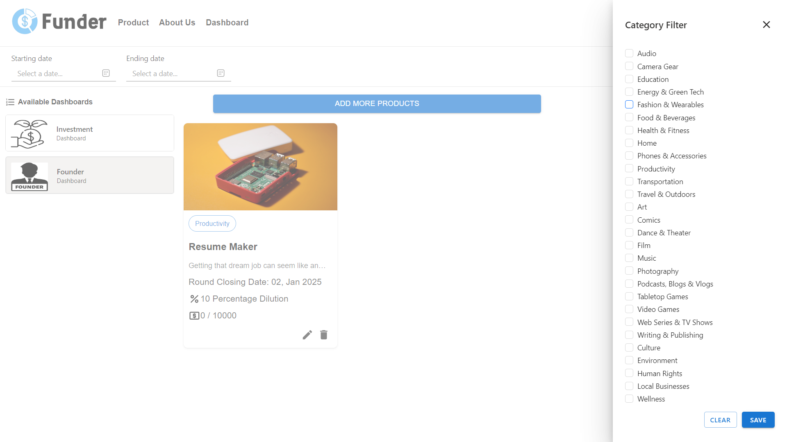
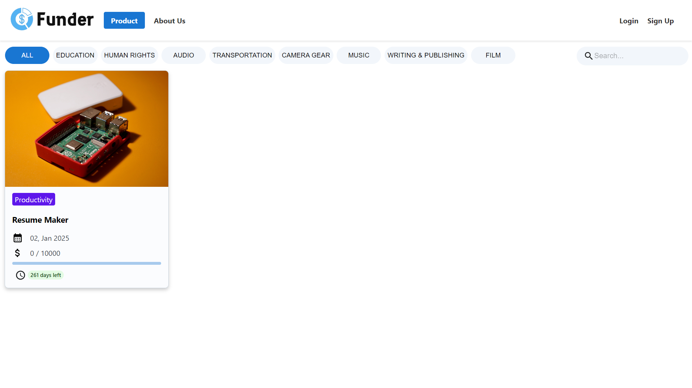

# Funder.com [(Live App Link)](https://funder-asdc.netlify.app/)

  

 

## About

Funder.com is a user-friendly React project that empowers small startups and investors. It lets investors support startups with just $1, and they can back as many as they'd like. Funder.com's mission is to make startup funding accessible, helping businesses thrive while offering investors the freedom to diversify their portfolios easily. It's the platform that levels the playing field, making entrepreneurial dreams a reality for everyone. 

## 🚀 Tech and Tools Used ⚒️🔥🔍

- 
- 
- 
- 
- 

## ⚙️ Features 🚀

- User Authentication by Email.
- Profile Management/Settings.
- Product Listing Page.
- Product Details Page.
- Investor Dashboard.
- Founder Dashboard.
- Payment Integration.
- Download Investment Certificate.
- Blogs and Forums.
- Comments on Listed Products.
- Email Notification.

## 📸 Screenshots

## Landing Page

## Founder Dashboard

## Founder Dashboard

## Investor Dashboard

## Add Product Form

## Product Page

## Product Details Page

## Payment Gateway

## Comment Section

#
## Team Members are Bhautik Koshiya, Drashti Navadiya,Parth Patel,Shreya Kapoor and Tathya Kapadia.

## Documentation

### External Dependencies
These are programming languages, frameworks, and other pieces of software required to run the application. A detailed list of dependencies, along with instructions on how to install and configure them are given in the document below:  
[**External Dependencies**](documentation/External_Dependencies.md)

### Build and Deployment
In order for the application to be used by users anywhere in the world, it must be built and deployed onto a server. Detailed instructions on how to deploy the application are given in the document below:  
[**Build and Deployment**](documentation/Build_And_Deployment.md)

### User Scenarios
All of the features provided by the application, as well as the various scenarios of interaction with the app by a user is documented in the file below:  
[**User Scenarios**](documentation/User_Scenarios.md)

## Contact

If you have any questions, feel free to contact us. We appreciate your feedback!

## Acknowledgements

We would like to thank the open source community for their continuous support and inspiration. We are always learning and improving, thanks to you.